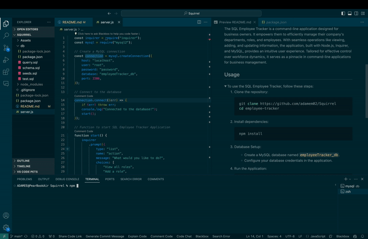

# SQL Employee Tracker

## Overview
This repository houses a powerful command-line application crafted with Node.js, Inquirer, and MySQL to seamlessly manage a company's intricate employee database. Elevate your organizational capabilities by effortlessly viewing and managing departments, roles, and employees with this robust application.

# Mock-Up

Link to Full Video 
https://drive.google.com/file/d/11eRRuQ9GAEjYJ1Md7mOz4YcweiYEuxSV/view?usp=sharing

## Description
The SQL Employee Tracker is a command-line application designed for business owners. It empowers them to efficiently manage their company's departments, roles, and employees. With seamless operations like viewing, adding, and updating information, the application, built with Node.js, Inquirer, and MySQL, provides an intuitive user experience. Tailored for effective control over workforce dynamics, it serves as a pinnacle in command-line applications for business management.


## Usage

<details>
  <summary>To use the SQL Employee Tracker, follow these steps:</summary>

  1. Clone the repository:
     ```bash
     git clone https://github.com/adamem02/Squirrel
     cd employee-tracker
     ```

  2. Install dependencies:
     ```bash
     npm install
     ```

  3. Database Setup:
     - Create a MySQL database named `employeeTracker_db`.
     - Configure your database credentials in the application.

  4. Run the Application:
     ```bash
     npm start
     ```
</details>

